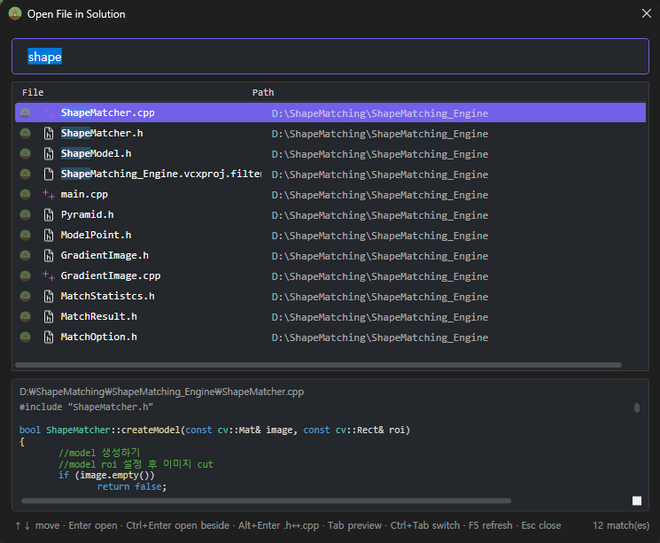
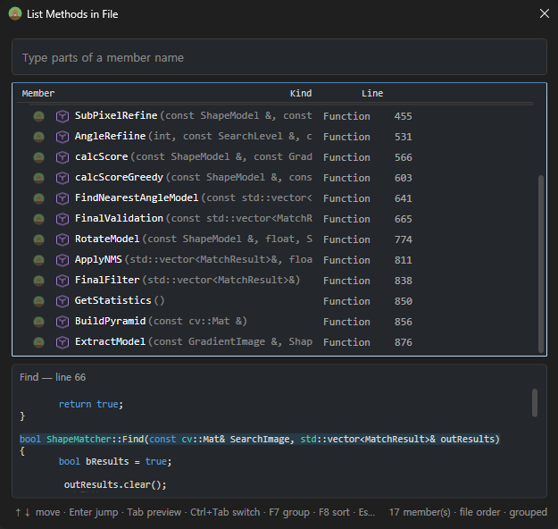
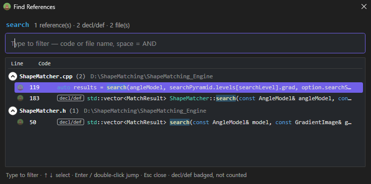
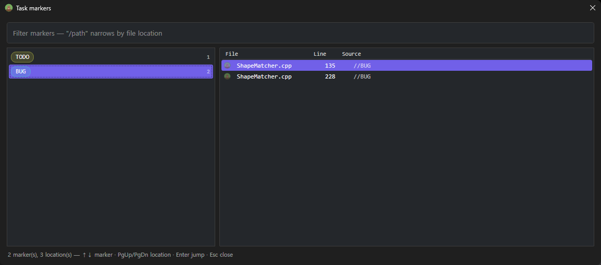

# MoleKey

**Keyboard-first navigation and comfort pack for Visual Studio 2022 / 2026.**

Open files, inspect symbols, browse references and move through your code
without leaving the keyboard. MoleKey keeps these navigation tools together,
backs up settings before changing them and provides one-click recovery.

## Install

Get it from the
[Visual Studio Marketplace](https://marketplace.visualstudio.com/items?itemName=MoleLab.MoleKey),
or download **MoleKey.vsix** from the
[latest release](https://github.com/BaeBulDuGi/molekey/releases/latest) and
double-click it. The installer detects every Visual Studio 2022 / 2026
instance on the machine (amd64 and ARM64) and lets you pick where to install.

## Screenshots

**Open File in Solution** (`Alt+Shift+O`) — type parts of the name or path,
arrows pick without leaving the search box, preview below.



**List Methods in File** (`Alt+M`) — the active document's members, grouped by
class, with the body of the selected one previewed underneath.



**Find All References** (`Alt+Shift+F`) — C/C++ call sites grouped by file with
syntax-colored lines, declarations badged and left out of the count, and a
filter box to narrow the list.



**Task markers** (`Shift+Alt+K`) — every `TODO` / `FIXME` / `BUG` in the
solution's comments: markers with counts on the left, their locations on the
right.



## Navigation

| Key | Window |
|---|---|
| `Alt+Shift+O` | **Open File in Solution** — every solution file, filtered as you type (space = AND terms) |
| `Alt+M` | **List Methods in File** — the active document's functions/fields/types grouped by class, Enter jumps |
| `Alt+Shift+S` | **Find Symbol in Solution** — every type & member defined in your code |
| `Alt+Shift+F` | **Find All References** — C/C++ gets a call-site list grouped by file; other languages keep the Visual Studio window |
| `Ctrl+Shift+G` | **Open File Under Caret** — resolves the `#include` or path at the caret across the whole solution |
| `Shift+Alt+J` | **Jump History** — every place you've been this session, Enter goes back |
| `Shift+Alt+K` | **Task Markers** — every `TODO` / `FIXME` / `HACK` in the solution's comments |
| `Shift+Alt+H` | **Hashtags** — browse every `#tag` written in comments across the solution |
| `Shift+Alt+G` | **Goto Hashtag** — locations of the `#tag` under the caret, Enter = next |
| `Ctrl+F12` | **Toggle Declaration/Definition** — C/C++ functions jump between the `.h` prototype and the `.cpp` body |

All finders share one flow: type to filter → arrows to pick (without leaving
the search box) → Enter to jump → Esc to close. Filter tokens work everywhere:
`/src` narrows results to paths containing `src`, and `.cpp` (file finder)
filters by extension. Matching is fuzzy — `mkap` finds `MasterKeyApplier` —
with exact prefix and substring hits always ranked first.

In the file finder, `Ctrl+Enter` opens the file beside what you were reading
(reusing the side group when there already is one), and `Alt+Enter` opens the
file's C/C++ partner (`.h` ↔ `.cpp`) instead of the row you picked — so
picking `foo.h` when you meant `foo.cpp` costs no second search.

With the editor split, `Alt+Shift+W` moves the caret to the group on the other
side and `Alt+Shift+U` puts the split away — both from the editor, where you
are when you want them.

Opened the wrong one? `Ctrl+Tab` cycles file → member → symbol (and
`Ctrl+1/2/3` goes straight to one) **carrying your query with it**, so a
misfire costs one keystroke instead of Esc-plus-retype.

## Hashtags — bookmarks that move with your code

Write `#likeThis` (starts with a letter, Unicode/Korean OK) in any comment:

```cpp
// #renderLoop frame starts here
/* #refactor split this class */
```

- Tags render **underlined in link-blue** right in the editor
- Typing `#` in a comment **autocompletes** existing tags
- Preprocessor directives (`#include`, `#region`) are never mistaken for tags
- Solution-wide index with per-file caching; unsaved edits included

## Task markers — `Shift+Alt+K`

The same comment parser also collects `TODO`, `FIXME`, `HACK`, `BUG`, `XXX`
and `UNDONE`, browsable the same way: markers on the left with counts, their
locations on the right, Enter jumps. Only **uppercase** markers in comments
count, so ordinary prose ("note that this is a bug") never shows up, and
neither does anything in code or a string literal. Unlike the built-in task
list this covers the whole solution, not just the files you have open. Edit the
list with `task_markers` in `%APPDATA%\VsMasterKey\settings.txt`.

## Jump History — `Shift+Alt+J`

The trail of places you've been this session, as a filterable list with code
previews. Navigate-backward (`Ctrl+-`) walks the same trail one blind step at a
time and overshooting loses the spot; here you can see it and go straight
there. It opens with the *previous* location selected, so Enter means "back
one". Nothing is written to disk.

## C/C++ references

- `Alt+Shift+F` on a C/C++ symbol lists its call sites grouped by file, with
  syntax-colored previews — including on Visual Studio 2026's new C++ editor
- An inline **"N references"** count next to each function definition (the
  CodeLens C++ never got); click it to open the same list
- `Alt+O` toggles header/source even when the counterpart lives in another
  folder or project — the whole solution is searched
- `Ctrl+F12` toggles between a function's declaration and its definition
  (and cycles through overload lines) — no browse database required

## Shortcut profile & custom keys

- **MoleKey profile**: a curated navigation key set (`Alt+G` go to definition,
  `Alt+O` toggle header/code, `Alt+←/→` navigate back/forward, …) applied only
  **with your consent**, merged next to the Visual Studio defaults — never replacing them.
  Original bindings are backed up on first touch; **Restore** brings them back exactly.
- **My Keys**: bind any of Visual Studio's ~10,000 commands to your own shortcut —
  search the command, capture the key in a dialog (even combinations Visual Studio already
  uses), pick Global or Text Editor scope, Apply. Conflict scanning included.

## Enhanced syntax coloring

Presets that give fields, parameters, statics and macros distinct colors
(dark & light variants), or build your own per-item scheme with a color picker.
Works on Visual Studio 2022 and 2026 (including the 2026 C++ editor rework).

**Moving from Visual Studio 2022?** It doesn't bring your Fonts and Colors along, and
importing the `.vssettings` through Visual Studio drops every C++ item — 2026 renamed
them. *Import from Visual Studio 2022…* on the Colors page maps the old names to the new
ones so the C++ colors survive too. The same page also puts the editor
settings the upgrade resets — scroll bar map mode, its preview tooltip,
scroll bar marks, line numbers — back within reach.

## Trust

- Every destructive operation (key bindings, colors) snapshots the original first — restore anytime
- All data stays local in `%APPDATA%\VsMasterKey` — nothing is transmitted
- Every editor decoration can be turned off

## Feedback

Bug reports and feature requests:
[Issues](https://github.com/BaeBulDuGi/molekey/issues). Release history:
[CHANGELOG](CHANGELOG.md).

---

*MoleKey (formerly VsMasterKey) is an independent extension and is not
affiliated with or endorsed by the vendors of any other product.*
